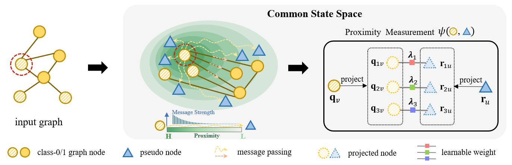

[NeurIPS2024] Towards Dynamic Message Passing on Graphs ($N^2$)
---

This is the official implementation of Towards Dynamic Message Passing on Graphs.
<!-- This is the official implementation of [Towards Dynamic Message Passing on Graphs](#). -->



# Preparation
## Requirements

- Python 3.7+
- PyTorch 1.10.0+
- PyTorch Geometric 2.1.0+


## Datasets

The datasets should be organized as:

```
.
├── data
│   └── ogb
│   └── coauthor
│   └── ...
│       
```

# Getting Started

- Train with command line

```bash
python train.py --cuda_num 'your chosen cuda' --nbatch 1 --testmode 'your output folder/' --dataset 'dataset name'
```

# Citation
If you find this repository useful in your research, please consider citing:)

```
@InProceedings{sun24neurips,
  title = {Towards Dynamic Message Passing on Graphs},
  author = {Sun, Junshu and Yang, Chenxue and Ji, Xiangyang and Huang, Qingming and Wang, Shuhui},
  booktitle = {Thirty-Eighth Annual Conference on Neural Information Processing Systems},
  year = {2024}
}
```