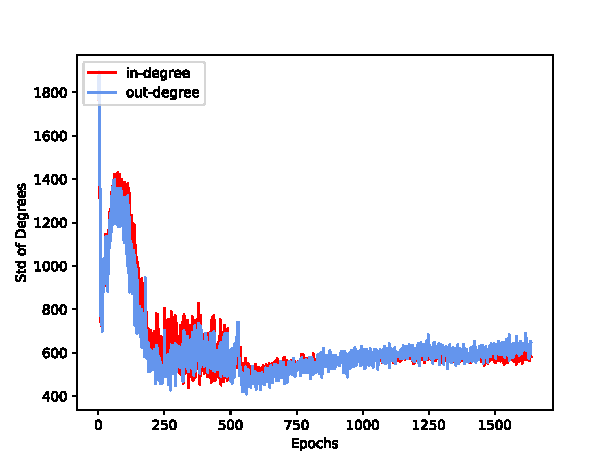
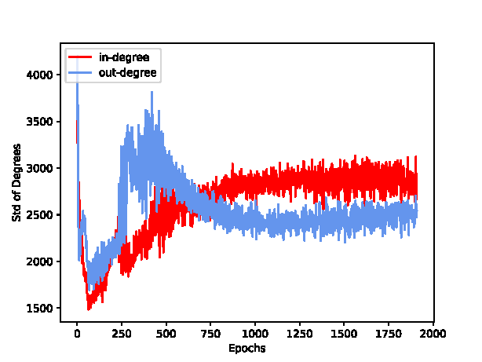
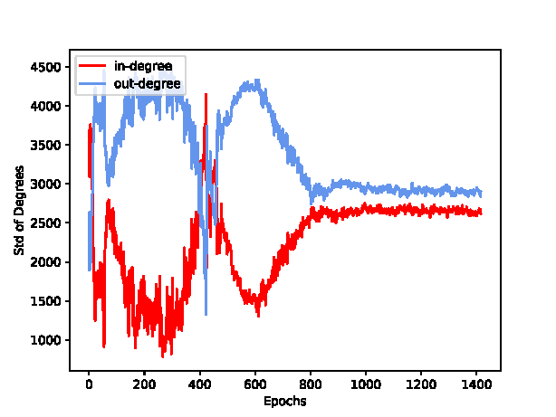

# The relationship between expander graphs and $N^2$
- We directly multiply the spatial proximity matrix $E^{np}$ and $E^{pn}$ to get the edge matrix $E$ of the approximate graph in $\mathtt{N^2}$. By removing the values smaller than average on $abs(E)$, we obtain the sparsified edge matrix $\hat{E}$. 
- During training on AmazonPhoto and CoauthorCS, we find that the standard deviation (std) of the degrees in the sparsified graphs decreases, indicating a gradual uniform on the node degrees.
    - The results on AmazonPhoto.

    

    - The results on CoauthorCS. We note that the decreasing phrases is first sharp, following by a re-increasing.

    
- During training on minesweeper, the std of the output degrees increases while decreasing with input degrees. This indicates that the learned sparsified graphs still have diverging node degrees.
    - The results on minesweeper. We note that the initial std value of input degree is very large while that of output degree is small.

    